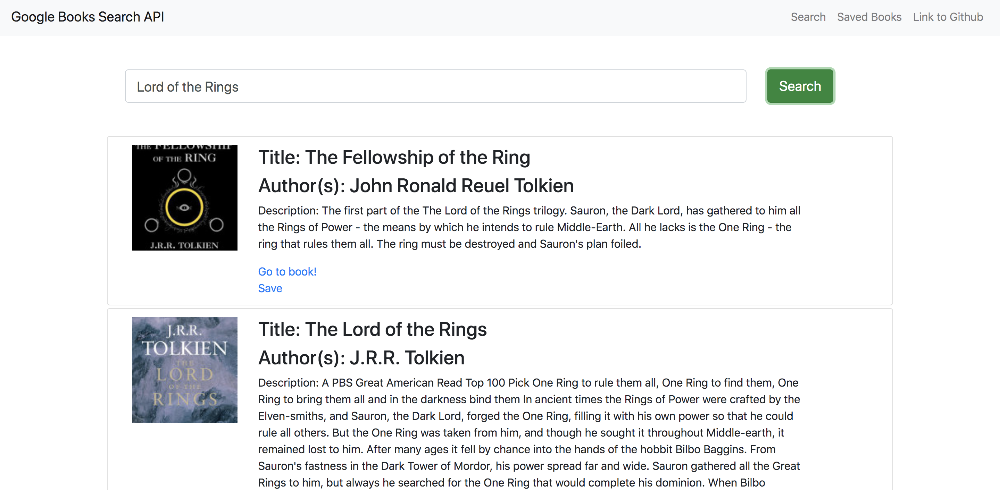

# React Search App

## What is the App?

Goole Books search app is a front and back end react app deployed via heroku. The main purpose of the app is to show the functionallity of a single page react app and a back end using mongoDB and axios which can handle large amounts of incoming data more easily and store book object data with mongoDB. The front end consists of a basic react app that makes calls to the back end with axios. The back end uses express, mongoose and mLab for mongoDB, axios for google api calls, and nodemon. Check out the app here! https://google-book-react-app.herokuapp.com/

